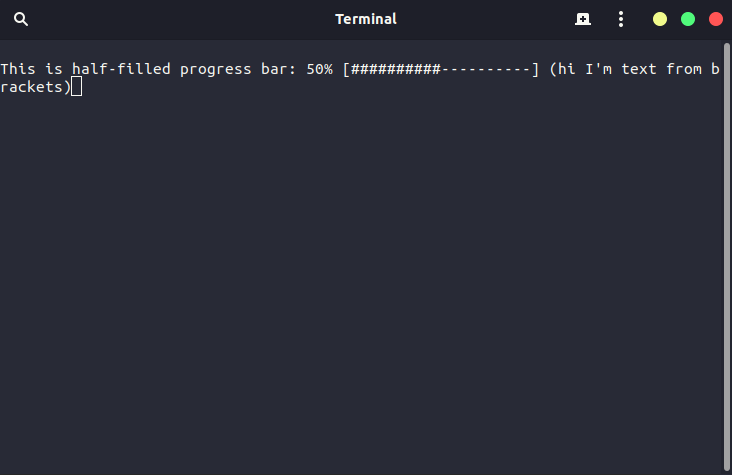

# Documentation for Progress Bar for C++

## Compilation
I created Makefiles for this project, so compilation is very simple. You need to type:
```shell
$ make -f <platform>.mk
```
where `<platform>` is the name of OS you're using. List of available platforms:
- `windows` - Windows MSVC
- `macos` - macOS Clang/LLVM
- `linux` - Linux gcc

### Clean
To clean the project you need to type the same command you'd run to compile, but with `clean` ending.
```shell
$ make -f <platform>.mk clean
```

## Library usage
After compile you should see a `progressbar` folder and 2 folders inside it - `lib` and `include`.

Now you need to include the `include` folder by adding to your **compiler command**:
- `/I <path/to/progressbar/include/>` - Windows MSVC (cl.exe)
- `-I<path/to/progressbar/include/>` - macOS Clang/LLVM (clang++)
- `-I<path/to/progressbar/include/>` - Linux g++ (g++)

Then you need to tell linker use library by adding to your **linker command**:
- `<path/to/progressbar/lib/progressbar.lib>` - Windows MSVC (cl.exe)
- `-L<path/to/progressbar/lib/> -lprogressbar` - macOS Clang/LLVM (clang++)
- `-L<path/to/progressbar/lib/> -lprogressbar` - Linux g++ (g++)

## Files documentation
See [files.md](files.md).

## Usage
First include library file:
```cpp
#include <ProgressBar.h>
```
Next import namespace:
```cpp
using namespace ProgressBar;
```

### Progress Bar


There are 3 methods in `ProgressBarManager` which manages the progress bar:
- `SetProgressBar`
- `UpdateProgressBar`
- `ClearProgressBar`

To set progress bar, use `SetProgressBar` method. If you want to change text/value of progress bar, call `UpdateProgresBar`. To delete call `ClearProgressBar`.

Code I used (on picture):
```cpp
ProgressBarManager manager;
manager.SetProgressBar(50, "This is half-filled progress bar:", "hi I'm text from brackets");
```
#
### Progress Indicator


There are 3 methods in `ProgressBarManager` which manages the progress indiicator:
- `SetProgressIndicator`
- `UpdateProgressIndicator`
- `ClearProgressIndicator`

To set progress indicator, use `SetProgressIndicator` method. If you want to change text on progress indicator, call `UpdateProgressIndicator` method. To delete call `ClearProgressIndicator`.  
Progress indicator **works asynchronously**.

Code I used (on picture):
```cpp
ProgressBarManager manager;
future<void> f = async(launch::async, [&manager]
{
    manager.SetProgressIndicator("This is progress indicator (with marquee effect)");
});
```
