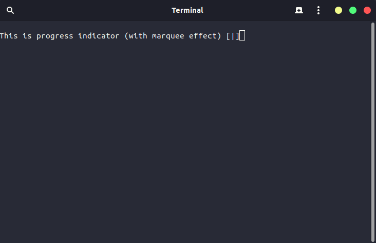

# Documentation for Progress Bar for C++

## Compilation
I created Makefiles for ProgressBar so You can compile this library very easily, you have to type just:
```shell
$ make
```

#### Windows
There are two ways to compile library on Windows:
- Using Git Bash  
  Open (or install if You don't have) Git Bash and type the same command you would enter on other OSs:
  ```shell
  $ make
  ```
- Using different Makefile  
  Open cmd and type following command:
  ```shell
  > make -f Makefile.win
  ```
  If You enter this command you will use a special Makefile for Windows.

## Files documentation
See [files.md](files.md).

## Usage
First include library file:
```cpp
#include <ProgressBar.h>
```
Next import namespace:
```cpp
using namespace ProgressBar;
```

### Progress Bar


There are 3 methods in `ProgressBarManager` which manages the progress bar:
- `SetProgressBar`
- `UpdateProgressBar`
- `ClearProgressBar`

To set progress bar, use `SetProgressBar` method. If you want to change text/value of progress bar, call `UpdateProgresBar`. To delete call `ClearProgressBar`.

Code I used (on picture):
```cpp
ProgressBarManager manager;
manager.SetProgressBar(50, "This is half-filled progress bar:", "hi I'm text from brackets");
```
#
### Progress Indicator


There are 3 methods in `ProgressBarManager` which manages the progress indiicator:
- `SetProgressIndicator`
- `UpdateProgressIndicator`
- `ClearProgressIndicator`

To set progress indicator, use `SetProgressIndicator` method. If you want to change text on progress indicator, call `UpdateProgressIndicator` method. To delete call `ClearProgressIndicator`.  
Progress indicator **works asynchronously**.

Code I used (on picture):
```cpp
ProgressBarManager manager;
async(launch::async, [&manager]
{
    manager.SetProgressIndicator("This is progress indicator (with marquee effect)");
});
```